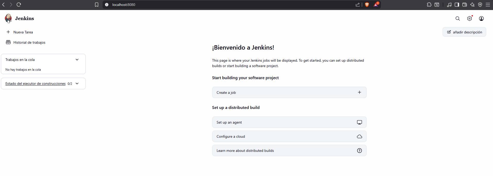
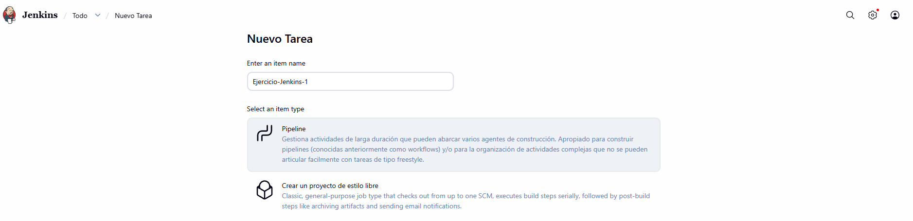
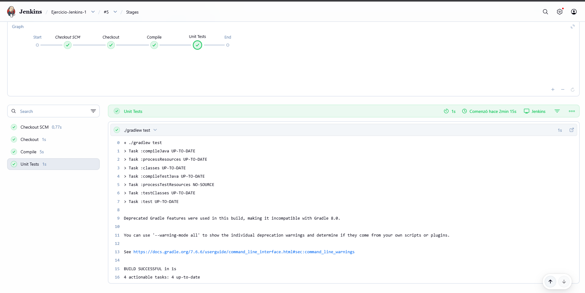
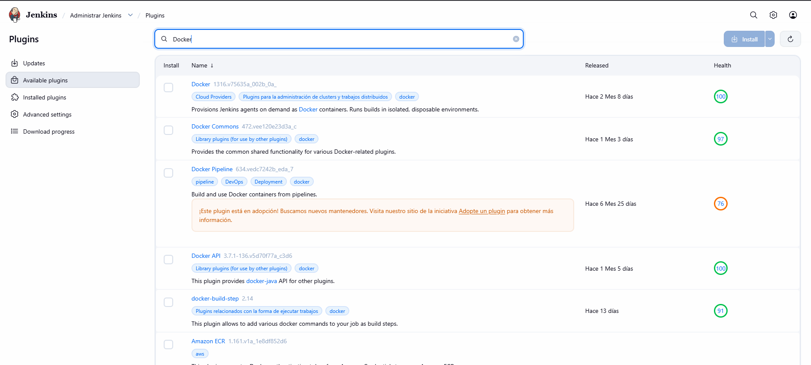
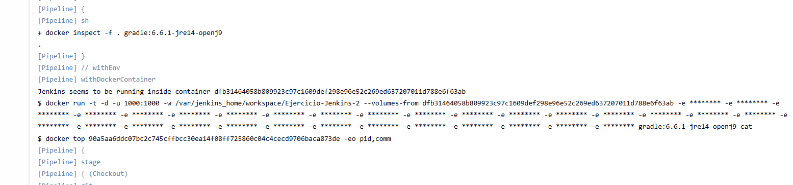
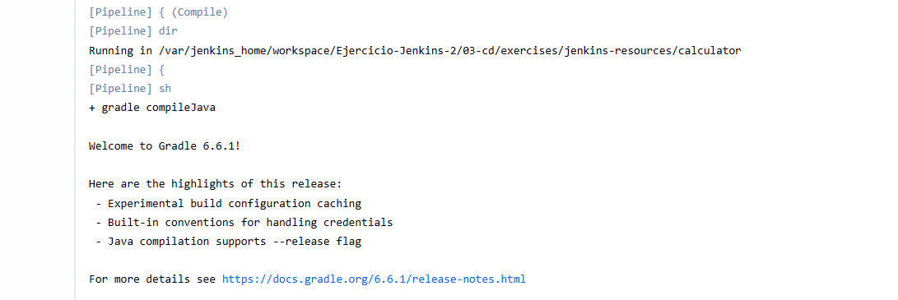
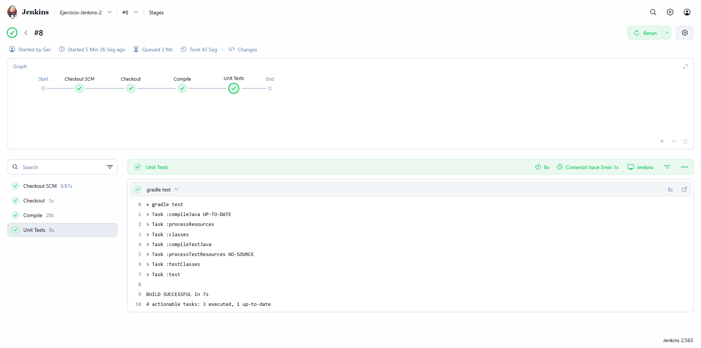

# Entregables CICD

# Ejercicios Jenkins

## 1. CI/CD de una Java + Gradle

En el directorio raíz de este [código fuente](https://github.com/Lemoncode/bootcamp-devops-lemoncode/tree/master/03-cd/exercises/jenkins-resources), crea un Jenkinsfile que contenga una pipeline declarativa con los siguientes stages:

- **Checkout**. Descarga de código desde un repositorio remoto, preferentemente utiliza GitHub.
- **Compile**. Compilar el código fuente utilizando gradlew compileJava.
- **Unit Tests**. Ejecutar los test unitarios utilizando gradlew test.

Para ejecutar Jenkins en local y tener las dependencias necesarias disponibles podemos construir una imagen a partir de este [Dockerfile](https://github.com/Lemoncode/bootcamp-devops-lemoncode/blob/master/03-cd/exercises/jenkins-resources/gradle.Dockerfile)

**Solución**:

Levantamos Jenkins con el Dockerfile de Grandle:

```bash
# Construir la imagen
docker build -t jenkins-gradle -f ./Ejercicios_Jenkins_1/gradle.Dockerfile .

# He tenido que cambiar el valor de GRADLE_SHA al utilizar la versión 7.6.6

# Levantar el contenedor
docker run -d -p 8080:8080 -p 50000:50000 \
  -v jenkins_home:/var/jenkins_home \
  --name jenkins-gradle \
  jenkins-gradle
```

Seguimos los primeros pasos y ya tenemos nuestro Jenkins disponible:



Creamos nueva tarea de tipo `Pipeline`:



En la configuración de la pipeline seteamos los siguientes campos:

  - Definition: Pipeline script from SCM (esto ya clona el repositorio)
  - SCM: Git
  - Repository URL: https://github.com/GeerDev/Entregables_CICD
  - Branch: */main
  - Script Path: Ejercicios_Jenkins_1/Jenkinsfile

Le damos a ejecutar la pipeline, comprobamos que todo ha ido bien, que ha descargado el código, que lo ha compilado y ha corrido los tests:



## 2. Modificar la pipeline para que utilice la imagen Docker de Gradle como build runner

- Utilizar Docker in Docker a la hora de levantar Jenkins para realizar este ejercicio.
- Como plugins deben estar instalados Docker y Docker Pipeline.
- Usar la imagen de Docker gradle:6.6.1-jre14-openj9.

**Solución**:

Paramos y eliminamos el contenedor actual:

```bash
docker stop jenkins-gradle
docker rm jenkins-gradle
```

Levantamos Jenkins con el socket de Docker montado (DinD):

```bash
docker run -d -p 8080:8080 -p 50000:50000 \
  -v jenkins_home:/var/jenkins_home \
  -v /var/run/docker.sock:/var/run/docker.sock \
  --name jenkins-dind \
  jenkins/jenkins
```

En la configuración de la pipeline seteamos los siguientes campos:

  - Definition: Pipeline script from SCM (esto ya clona el repositorio)
  - SCM: Git
  - Repository URL: https://github.com/GeerDev/Entregables_CICD
  - Branch: */main
  - Script Path: Ejercicios_Jenkins_2/Jenkinsfile

He instalado los plugins de `Docker` y `Docker Pipeline` para este ejercicio.



Además he instalado algunos paquetes y he cambiado los permisos para el docker.sock (esto es porque es una práctica pero jamás lo haria en un ámbiente productivo):

```bash
docker exec -u root jenkins-dind apt-get update
docker exec -u root jenkins-dind apt-get install -y docker.io
docker exec -u root jenkins-dind chmod 666 /var/run/docker.sock
```

Vemos ahora en los logs del console output del build que efectivamente se está utilizando Docker:



Además comprobamos que el pipeline esta utilizando esa versión de grandle para la compilación y los tests:



Comprobamos que todo que la build se ha ejecutado con éxito y que se han cumplido todos los pasos:



Si el día de mañana tuvieramos 10 proyectos con versiones distintas de Gradle, necesitas 10 imágenes distintas de Jenkins en el caso de no utilizar Docker.

Ahora directamente en el agent del Jenkinsfile **ganamos la flexibilidad** de poder utilizar cualquier imagen que se pueda cargar con Docker.

# Ejercicios GitHub Actions

## 1. Crea un workflow CI para el proyecto de frontend - OBLIGATORIO

Copia el directorio [.start-code/hangman-front](https://github.com/Lemoncode/bootcamp-devops-lemoncode/tree/master/03-cd/03-github-actions/.start-code/hangman-front) en el directorio raíz del mismo repositorio que usaste para las clases de GitHub Actions. Si no lo creaste, crea un repositorio nuevo.

Después crea un nuevo workflow que se dispare cuando haya cambios en el proyecto hangman-front y exista una nueva pull request (deben darse las dos condiciones a la vez). El workflow ejecutará las siguientes operaciones:

- Build del proyecto de front
- Ejecutar los unit tests

**Solución**:

Se ha creado el workflow en [.github/workflows/hangman-front-ci.yml](.github/workflows/hangman-front-ci.yml).

El workflow se dispara con `pull_request` filtrando únicamente los cambios bajo `Ejercicios_GithubActions_1/hangman-front/**`, lo que garantiza que **ambas condiciones** se cumplan a la vez (nueva PR + cambios en el proyecto).

Los pasos que ejecuta son:
1. **Checkout** del código.
2. **Setup Node.js 24** con caché de dependencias.
3. **npm ci** para instalar dependencias de forma limpia y reproducible.
4. **npm run build** para construir el proyecto.
5. **npm test** para ejecutar los unit tests.

Para probar si está funcionando correctamente:

```bash
git checkout -b test/ci-workflow
# Hacemos cambios en cualquier fichero de hangman-front
git add .
git commit -m "test: trigger CI workflow"
git push origin test/ci-workflow
```

Desde la interfaz de Github creamos la PR y comprobamos el workflow:


## 2. Crea un workflow CD para el proyecto de frontend - OBLIGATORIO

Crea un nuevo workflow que se dispare manualmente y haga lo siguiente:

- Crear una nueva imagen de Docker
- Publicar dicha imagen en el [container registry de GitHub](https://docs.github.com/en/packages/working-with-a-github-packages-registry/working-with-the-container-registry)

## 3. Crea un workflow que ejecute tests e2e - OPCIONAL

Crea un workflow que se lance de la manera que elijas y ejecute los tests e2e que encontrarás en [este enlace](https://github.com/Lemoncode/bootcamp-devops-lemoncode/tree/master/03-cd/03-github-actions/.start-code/hangman-e2e/e2e). Puedes usar [Docker Compose](https://docs.docker.com/compose/gettingstarted/) o [Cypress action](https://github.com/cypress-io/github-action) para ejecutar los tests.

**Como ejecutar los tests e2e**
- Tanto el front como la api se deben estar corriendo

```bash
docker run -d -p 3001:3000 hangman-api
docker run -d -p 8080:8080 -e API_URL=http://localhost:3001 hangman-front
```

- Los tests se ejecutan desde el directorio hangman-e2e/e2e haciendo uso del comando npm run open

```bash
cd hangman-e2e/e2e
npm run open
```

## 4. Crea una custom JavaScript Action - OPCIONAL

Crea una custom JavaScript Action que se ejecute cada vez que una issue tenga la etiqueta motivate. La acción deberá pintar por consola un mensaje motivacional. Puedes usar esta [API](https://favqs.com/api) gratuita. Puedes encontrar más información de como crear una custom JS action en [este enlace](https://docs.github.com/es/actions/tutorials/create-actions/create-a-javascript-action).

```bash
curl https://favqs.com/api/qotd
```